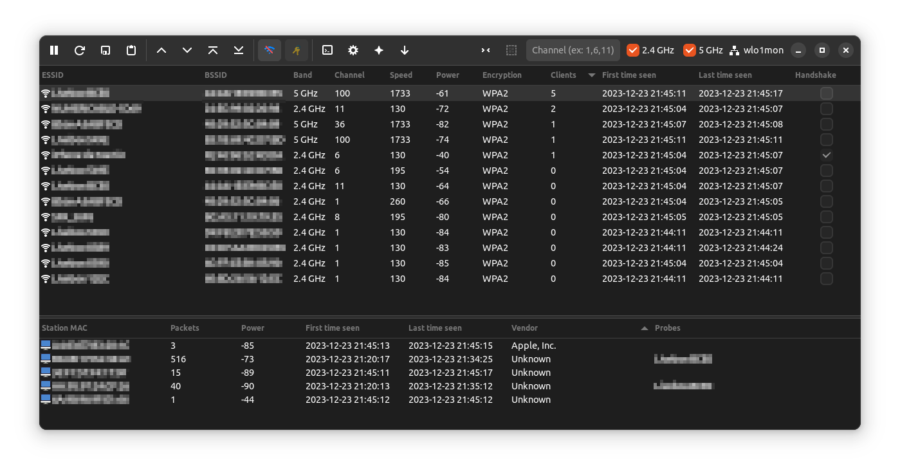

<h1 align="center">
  <br>
  Airgorah
  </a>
</h1>

<h4 align="center">A WiFi auditing software that can perform deauth attacks and passwords recovery</h4>

<p align="center">
  <a href="https://github.com/martin-olivier/airgorah/releases/tag/v0.1.0">
    
  </a>
  <a href="https://github.com/martin-olivier/airgorah/blob/main/LICENSE">
    
  </a>
  <a href="https://www.rust-lang.org/">
    
  </a>
  <a href="https://github.com/martin-olivier/airgorah/actions/workflows/CI.yml">
    
  </a>
</p>



`Airgorah` can be used to audit a WiFi network by discovering the clients connected to it, performing deauth attacks against specific clients or all the clients connected to the network, or by recovering the password of the access point.

It is written in Rust and uses [GTK4 bindings](https://github.com/gtk-rs/gtk4-rs) for the graphical part. The software is based on [aircrack-ng](https://github.com/aircrack-ng/aircrack-ng) tools suite.

`⭐ Don't forget to put a star if you like the project!`

## Legal

⚠️ Airgorah is designed to be used in testing and discovering flaws in networks you are owner of. Performing attacks on WiFi networks you are not owner of is illegal in almost all countries. I am not responsible for whatever damage you may cause by using this software.

## Requirements

This software only works on `linux` and requires `root` privileges to run.

You will also need a wireless network card that supports `monitor mode` and `packet injection`.

## Installation

You can find pre-built releases for `Debian` based distributions [here](https://github.com/martin-olivier/airgorah/releases/latest) (Ubuntu, PopOS, Mint, Kali). You will just need to download the package and install it with the following command:

```sh
sudo apt install <path_to_deb_package>
```

Otherwise, if you'd like to compile from source, you can follow this [guide](docs/build_from_source.md).

## License

This project is released under [MIT](LICENSE) license.

## Contributing

Pull requests are welcome. For major changes, please open an issue first to discuss what you would like to change.

## Future

- [ ] WPA handshake capture
- [ ] WPA handshake decryption (dictionary / bruteforce)
- [ ] WPS attack feature
- [ ] WEP attack feature
- [ ] Provide releases for other linux distributions (Arch, Fedora, ...)
- [ ] Provide releases for other architectures (amd, arm, ...)
- [ ] Improve the code quality and the documentation
- [ ] Improve the UI
